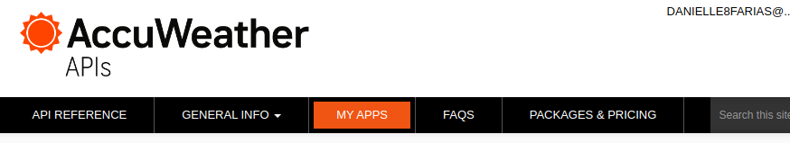
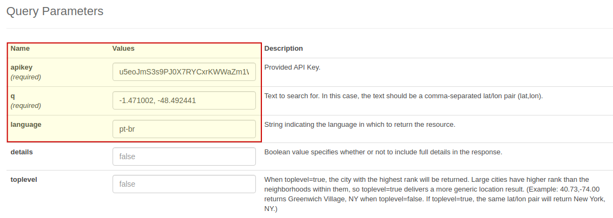

# Sobre esse arquivo

- Requer o registro no site [AccuWeather](https://developer.accuweather.com/) para a chave da API.

- Após o registro ir em **MY APPS**

- Adicione uma nova aplicação e preencha as informações requisitadas.

- Em seguida, clique no nome da sua aplicação para pegar a chave da API.

- Agora vá em **API PREFERENCE** e em **LOCATIONS API**.

- Vá em **Geoposition Search**

- Preencha os parâmetros como a chave da API, longitude e latitude, e linguagem

- E clique no botão para enviar a requisição. Se estiver tudo funcionando, ele retornará 200.

- Vá até a aba cURL e pegar a url que está entre aspas.

- Essa url será usada no código com as devidas modificações.

- Agora vá em **API PREFERENCE** e em **CURRENT CONDITIONS API**.

- Preencha o valor da chave e da linguagem, conforme a imagem

