# Sobre o uso da API

- Foi feito o registro no site [AccuWeather](https://developer.accuweather.com/) para conseguir uma chave da API seguindo os passos abaixo:

Após o registro ir em **MY APPS**

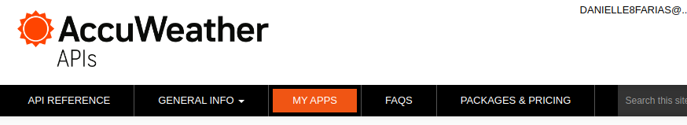

Adicione uma nova aplicação e preencha as informações requisitadas. Em seguida, clique no nome da sua aplicação para pegar a chave da API.

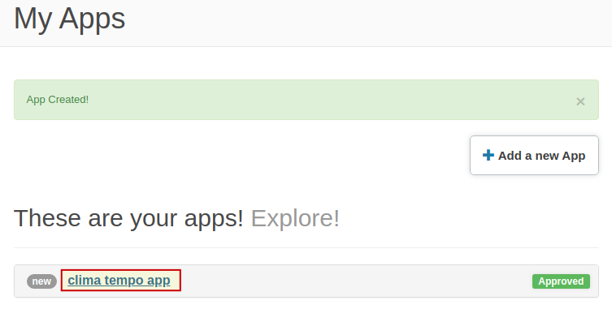

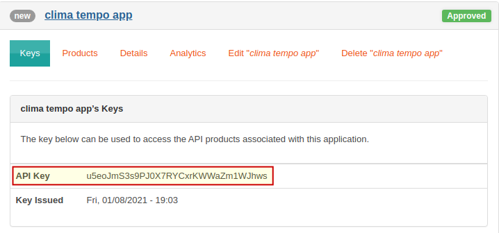

----

## Pegando o código do local

Agora vá em **API PREFERENCE** e em **LOCATIONS API**.

Vá em **Geoposition Search**

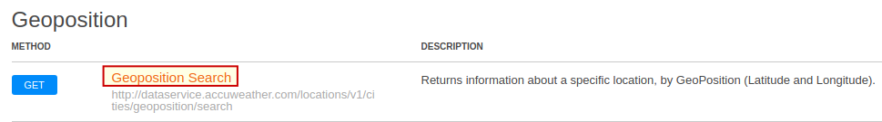

Preencha os parâmetros como a chave da API, longitude e latitude, e linguagem

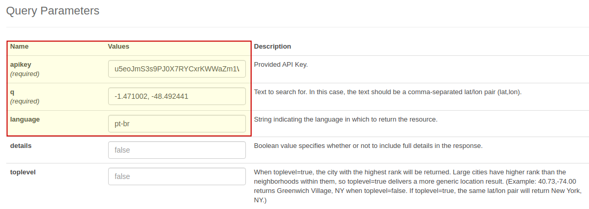

E clique no botão para enviar a requisição. Se estiver tudo funcionando, ele retornará 200.

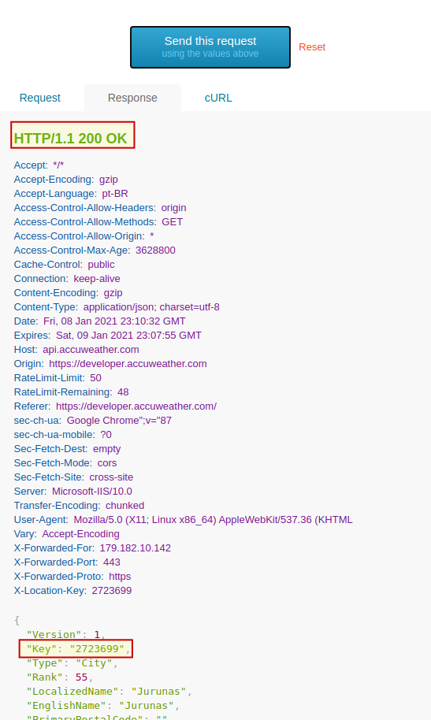

Vá até a **aba cURL** e pegar a url que está entre aspas.

Essa url será usada no código com as devidas modificações.

----

## Pegando o tempo e o clima do local

Agora vá em **API PREFERENCE** e em **CURRENT CONDITIONS API**.

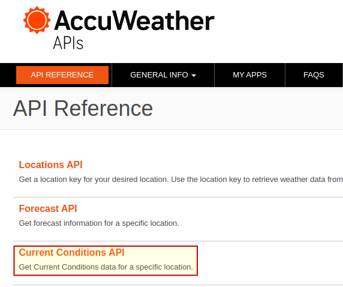

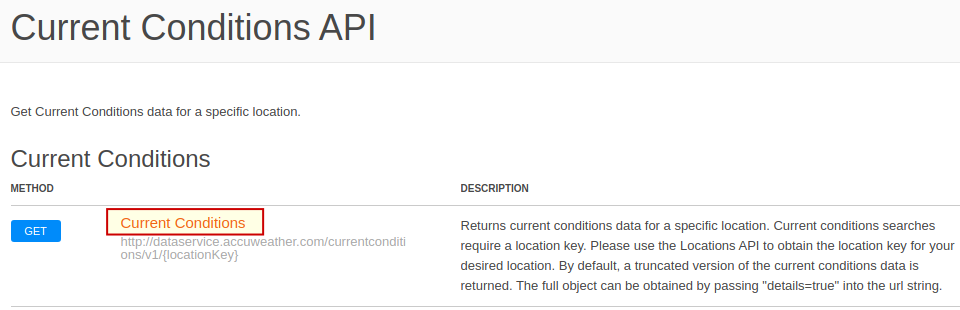

Preencha o valor das chaves da localização e API e da linguagem, conforme a imagem

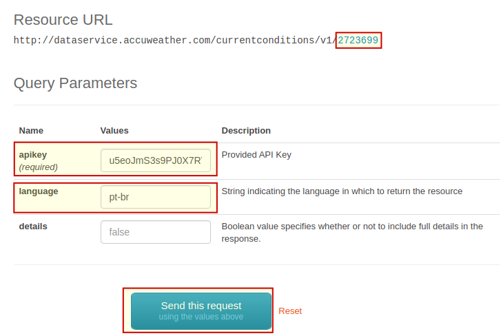

E então clique para enviar a requisição. 

A seguinte imagem aparecerá com o resultado da requisição

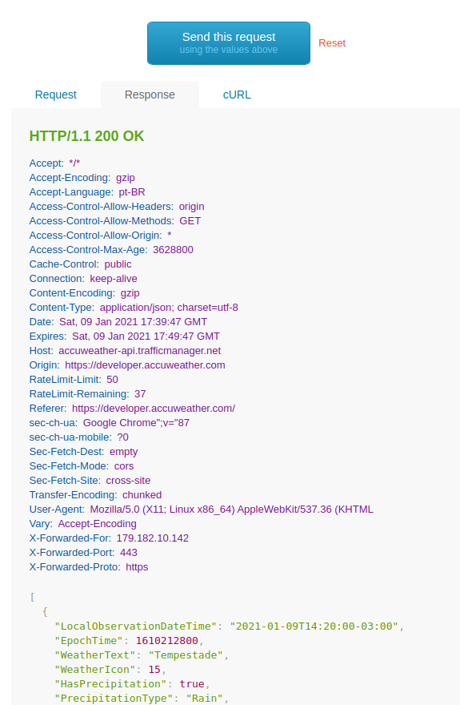

Vá até a **aba cURL** e pegar a url que está entre aspas.

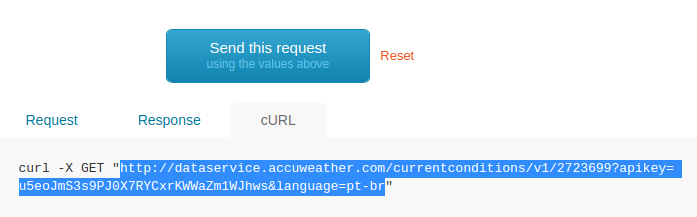

Essa url será usada no código com as devidas modificações.
