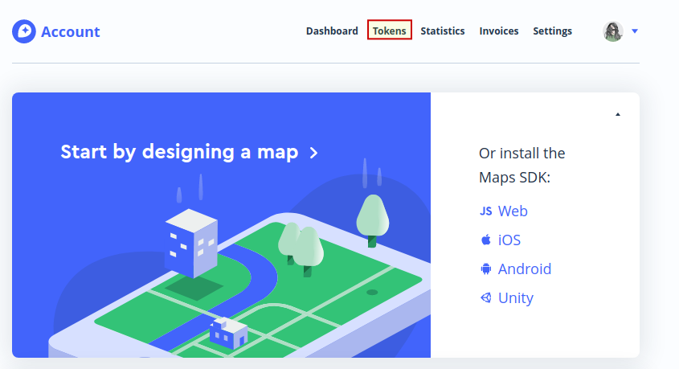
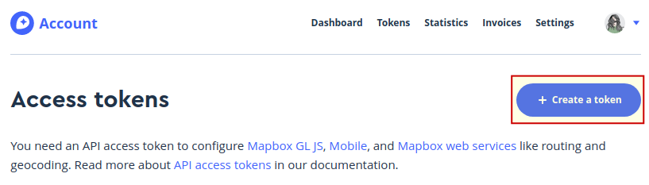
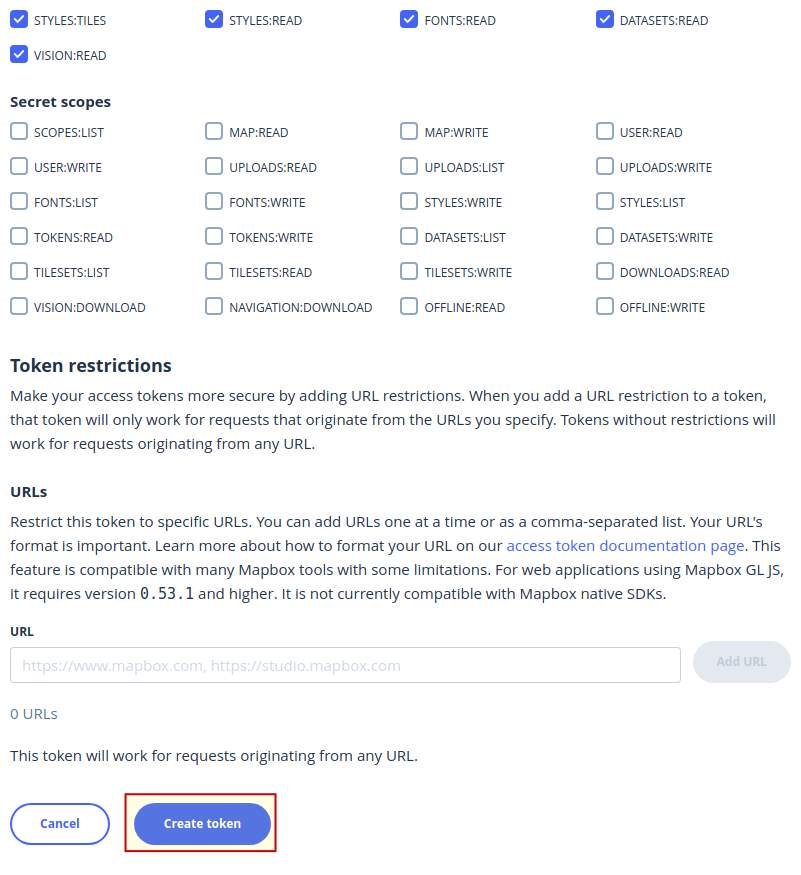
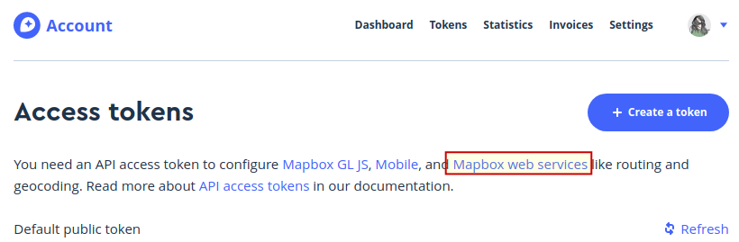
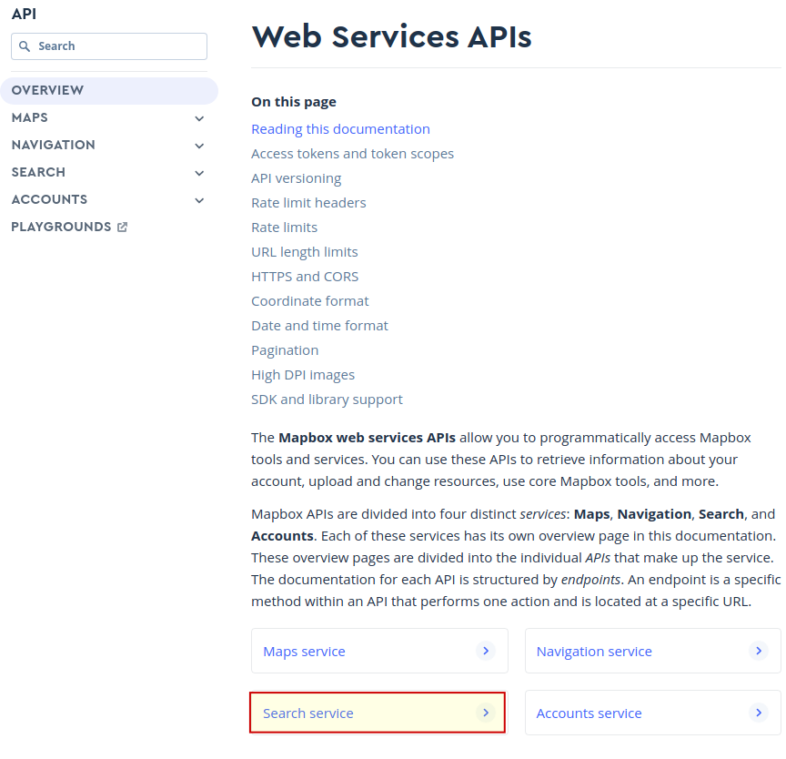
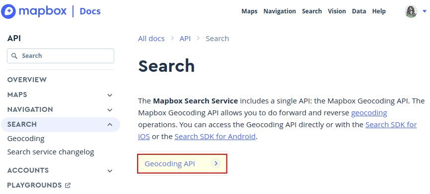
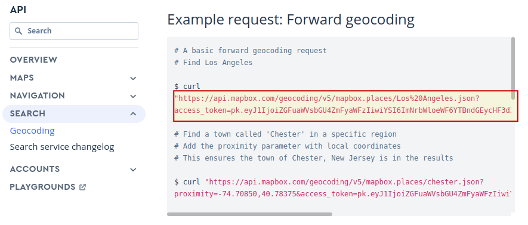

# Sobre o uso da API

- Foi feito o registro no site [MapBox](https://account.mapbox.com/auth/signup/) para conseguir uma chave da API seguindo os passos abaixo:

Após o registro ir em **Tokens**

Em seguida clique no botão para criar um novo token.

Dê um nome e mantenha as configurações padrão e confirme a criação do token.

Em seguida será necessário confirma a sua senha de usuária.

Após criar o token, ao voltar a de acesso a estes, clique em **Mapbox Web Services**.

Em seguida, clique em **Search Service**.

E em **geocoding API**.

Então vou pegar um exemplo do uso da API e fazer as substituições necessárias.

